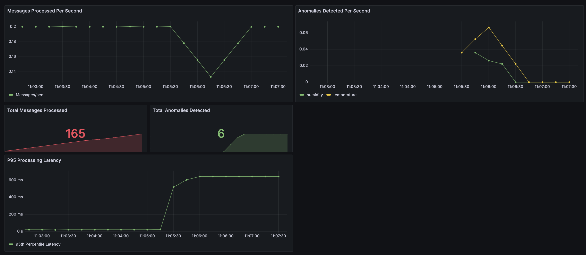
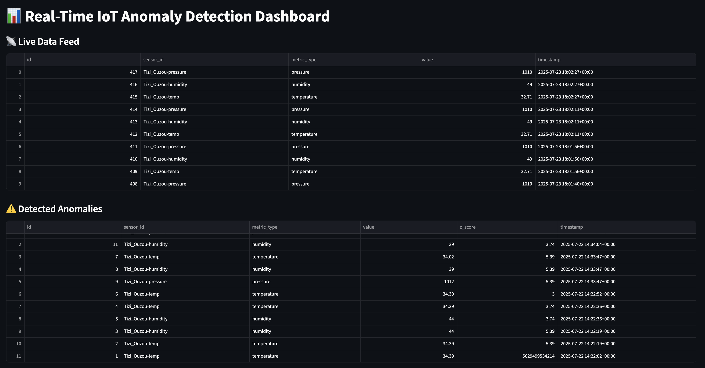
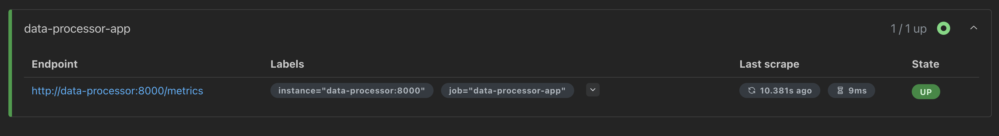
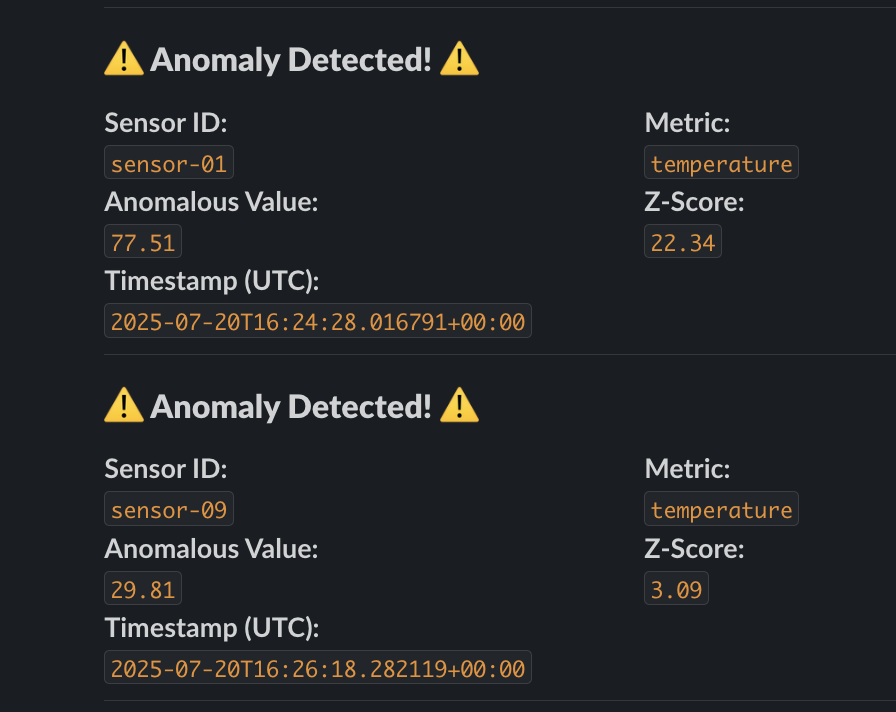

# Real-Time IoT Anomaly Detection Pipeline with Advanced Monitoring


This project is a complete, end-to-end data engineering solution that demonstrates a scalable, real-time pipeline for ingesting, processing, and analyzing streaming data. It identifies anomalies using statistical methods and triggers instant alerts. The project is fully containerized and features two distinct monitoring solutions: a data-centric Streamlit dashboard and an industry-standard systems monitoring stack with Prometheus and Grafana.

---

## 🚀 Core Features

*   **Real-Time Data Ingestion**: A Python producer ingests live data from the OpenWeatherMap API and streams it into an Apache Kafka topic.
*   **Scalable Stream Processing**: A containerized Python consumer group reads from Kafka, processing data in real-time.
*   **Stateful Anomaly Detection**: A rolling Z-score algorithm detects statistical anomalies for each unique sensor, adapting to its specific data patterns.
*   **Instant Alerting System**: Automatically sends detailed, formatted alerts to a Slack channel via webhook when an anomaly is detected.
*   **Persistent Data Storage**: All incoming data and detected anomalies are stored in a PostgreSQL database for historical analysis.
*   **Dual Monitoring Systems**:
    *   **Grafana + Prometheus:** A robust, industry-standard stack for monitoring application health and performance metrics (e.g., messages processed/sec, latency, anomalies detected).
    *   **Streamlit:** A user-friendly dashboard for viewing the raw data content and anomaly logs directly from the database.
*   **Fully Containerized**: The entire backend infrastructure (Kafka, Zookeeper, PostgreSQL, Python App, Prometheus, Grafana) is defined in Docker and managed with a single Docker Compose command.
*   **Automated CI/CD**: A GitHub Actions workflow automatically runs a `pytest` test suite on every push, ensuring code quality and reliability.

---

## 🏛️ System Architecture

The architecture is designed for scalability, resilience, and observability. Data flows from the producer through Kafka to the Python consumer. The consumer analyzes the data, sends it to PostgreSQL, and triggers Slack alerts. The Prometheus server scrapes metrics from the consumer, which are then visualized in Grafana. A separate Streamlit dashboard queries PostgreSQL directly.

```mermaid
flowchart TD
    subgraph "External Services"
        K[OpenWeatherMap API]
        J[Slack API]
    end

    subgraph "Host Machine"
        A[Data Producer (API Client)]
        S[Streamlit Dashboard]
    end

    subgraph "Docker Environment (Virtual Network)"
        B[Kafka Broker]
        D[Python Consumer: data-processor]
        H[PostgreSQL Database]
        P[Prometheus]
        G[Grafana]
    end

    K -- Fetches data --> A
    A -- (localhost:29092) --> B
    D -- Consumes from --> B
    
    D -- Analyzes data --> D
    D -- Anomaly Found --> F(Slack Alert)
    F -- Sends alert via HTTP --> J
    
    D -- Writes all data --> H
    S -- Queries data from --> H

    P -- Scrapes /metrics endpoint --> D
    G -- Queries metrics from --> P

    style D fill:#f9f,stroke:#333,stroke-width:2px
    style H fill:#ccf,stroke:#333,stroke-width:2px
    style G fill:#FFBF00,stroke:#333,stroke-width:2px
```

---

## 🔧 Tech Stack

*   **Data Streaming**: Apache Kafka
*   **Backend & Data Processing**: Python
*   **Database**: PostgreSQL
*   **Systems Monitoring**: Prometheus, Grafana
*   **Data Dashboard**: Streamlit
*   **Containerization**: Docker, Docker Compose
*   **Testing**: Pytest, Pytest-Cov
*   **CI/CD**: GitHub Actions
*   **Key Python Libraries**: `confluent-kafka`, `psycopg2-binary`, `SQLAlchemy`, `pandas`, `numpy`, `prometheus-client`

---

## ✨ System in Action

### Advanced Systems Monitoring (Grafana)
Live dashboard showing pipeline throughput, latency, and anomaly counts.


### Data Content Dashboard (Streamlit)
Live view of the raw data flowing into the database and a log of detected anomalies.


### Prometheus & Slack
Prometheus successfully scraping metrics from the Python application, and a resulting anomaly alert in Slack.
| Prometheus Targets | Slack Alert |
|---|---|
|  |  |

---

## ⚙️ How to Run Locally

### Prerequisites
*   Docker and Docker Compose installed.
*   Python 3.9+ installed.
*   An OpenWeatherMap API Key and a Slack Incoming Webhook URL.

### Setup
1.  **Clone the repository:**
    ```bash
    git clone https://github.com/YOUR_USERNAME/real-time-anomaly-detection-pipeline.git
    cd real-time-anomaly-detection-pipeline
    ```

2.  **Create the environment file:**
    Copy the example file and fill in your secret keys and webhook URL.
    ```bash
    cp .env.example .env
    ```

3.  **Install Python dependencies:**
    This is for the producer and Streamlit dashboard that run on your host machine.
    ```bash
    pip install -r requirements.txt
    ```

### Launch the Pipeline
1.  **Start the entire backend stack:**
    This single command starts Kafka, Postgres, Prometheus, Grafana, and the Python consumer. From the project root directory, run:
    ```bash
    docker-compose -f docker/docker-compose.yml up --build -d
    ```
    
2.  **Start the data producer:**
    In a new terminal (from the project root):
    ```bash
    python3 -m pipeline.kafka_producer
    ```

3.  **Explore the Dashboards:**
    *   **Grafana (Systems Monitoring):** Open your browser to `http://localhost:3000` (login with `admin`/`admin`).
    *   **Streamlit (Data Content):** In a new terminal, run `streamlit run dashboard/app.py`. Your dashboard will be at `http://localhost:8501`.

### Running Tests
To run the automated unit tests, execute the following command from the project root:
```bash
python3 -m pytest
```

### Shutting Down
To stop all running Docker containers and remove the network:
```bash
docker-compose -f docker/docker-compose.yml down
```
To delete the database and Prometheus data volumes as well, add the `-v` flag: `docker-compose -f docker/docker-compose.yml down -v`
