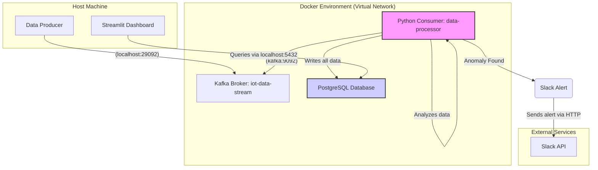

# Real-Time IoT Anomaly Detection Pipeline


This project is a complete, end-to-end data engineering solution that demonstrates a scalable, real-time pipeline for ingesting, processing, and analyzing IoT sensor data. It identifies anomalies using statistical methods and triggers instant alerts, with a live dashboard for monitoring.

---

## 🚀 Core Features

*   **Real-Time Data Ingestion**: A Python producer simulates IoT sensor data (temperature, humidity, pressure) and streams it into an Apache Kafka topic.
*   **Scalable Stream Processing**: A containerized Python consumer group reads from Kafka, processing data in real-time.
*   **Stateful Anomaly Detection**: A rolling Z-score algorithm detects statistical anomalies for each unique sensor, adapting to its specific data patterns.
*   **Instant Alerting System**: Automatically sends detailed, formatted alerts to a Slack channel via webhook when an anomaly is detected.
*   **Persistent Data Storage**: All incoming data and detected anomalies are stored in a PostgreSQL database for historical analysis and dashboarding.
*   **Live Monitoring Dashboard**: A Streamlit application provides a live view of the data stream, a log of all detected anomalies, and summary charts.
*   **Fully Containerized**: The entire backend infrastructure (Kafka, Zookeeper, PostgreSQL, Python App) is defined in Docker and managed with a single Docker Compose command.
*   **Automated CI/CD**: A GitHub Actions workflow automatically runs the pytest test suite on every push, ensuring code quality and reliability.

---

## 🏛️ System Architecture

The architecture is designed for scalability and resilience. Data flows from the producer through the Kafka message broker, where it is consumed by the containerized processing service. This service performs anomaly detection, routes data to the database, and triggers alerts. The Streamlit dashboard queries the database to provide visualizations.



---

## 🔧 Tech Stack

*   **Data Streaming**: Apache Kafka
*   **Backend & Data Processing**: Python
*   **Database**: PostgreSQL
*   **Dashboard**: Streamlit
*   **Containerization**: Docker, Docker Compose
*   **Testing**: Pytest, Pytest-Cov, Requests-Mock
*   **CI/CD**: GitHub Actions
*   **Key Python Libraries**: `confluent-kafka`, `psycopg2-binary`, `SQLAlchemy`, `pandas`, `numpy`, `scikit-learn`

---

## ✨ System in Action

**Live Monitoring Dashboard:**


**Anomaly Alert in Slack:**


**Consumer Terminal Detecting an Anomaly:**


---

## ⚙️ How to Run Locally

### Prerequisites
*   Docker and Docker Compose installed.
*   Python 3.9+ installed.
*   A Slack account with an Incoming Webhook URL.

### Setup
1.  **Clone the repository:**
    ```bash
    git clone https://github.com/ACPrograms/real-time-anomaly-detection-pipeline.git
    cd real-time-anomaly-detection-pipeline
    ```

2.  **Create the environment file:**
    Copy the example environment file and fill in your details.
    ```bash
    cp .env.example .env
    ```
    Open the `.env` file and paste your Slack Webhook URL. The database credentials can remain as they are for local development.

3.  **Install Python dependencies for the producer and dashboard:**
    ```bash
    pip install -r requirements.txt
    ```

### Launch the Pipeline
1.  **Start the entire backend stack (Kafka, Postgres, Consumer):**
    From the project root directory, run:
    ```bash
    docker-compose -f docker/docker-compose.yml up --build -d
    ```
    
2.  **Start the data producer:**
    In a new terminal (from the project root):
    ```bash
    python3 -m pipeline.kafka_producer
    ```

3.  **Launch the monitoring dashboard:**
    In a third terminal (from the project root):
    ```bash
    streamlit run dashboard/app.py
    ```
    Your dashboard will be available at `http://localhost:8501`.

### Running Tests
To run the automated unit tests, execute the following command from the project root:
```bash
python3 -m pytest
```

### Shutting Down
To stop all running Docker containers:
```bash
docker-compose -f docker/docker-compose.yml down
```
